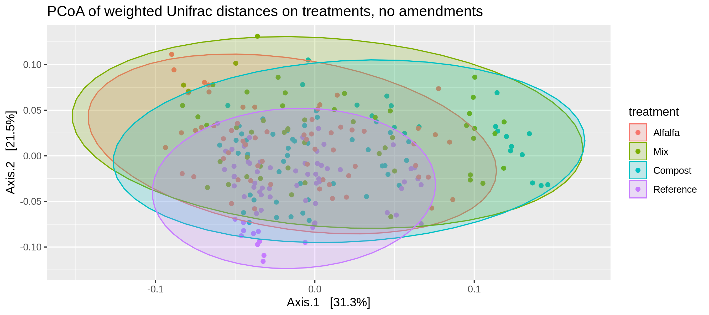
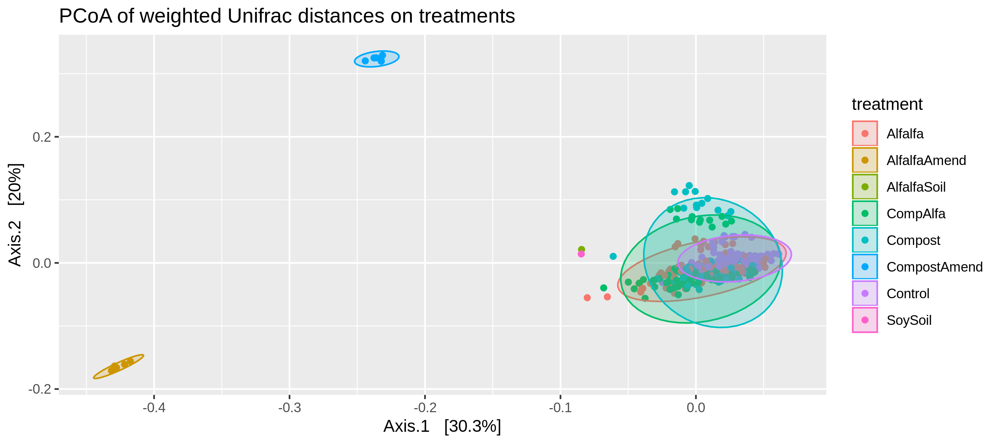
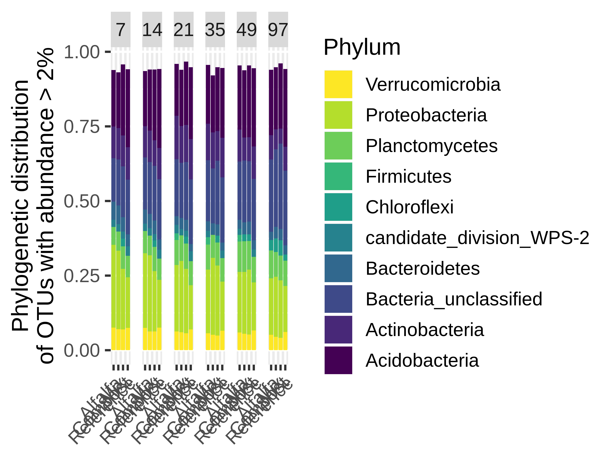
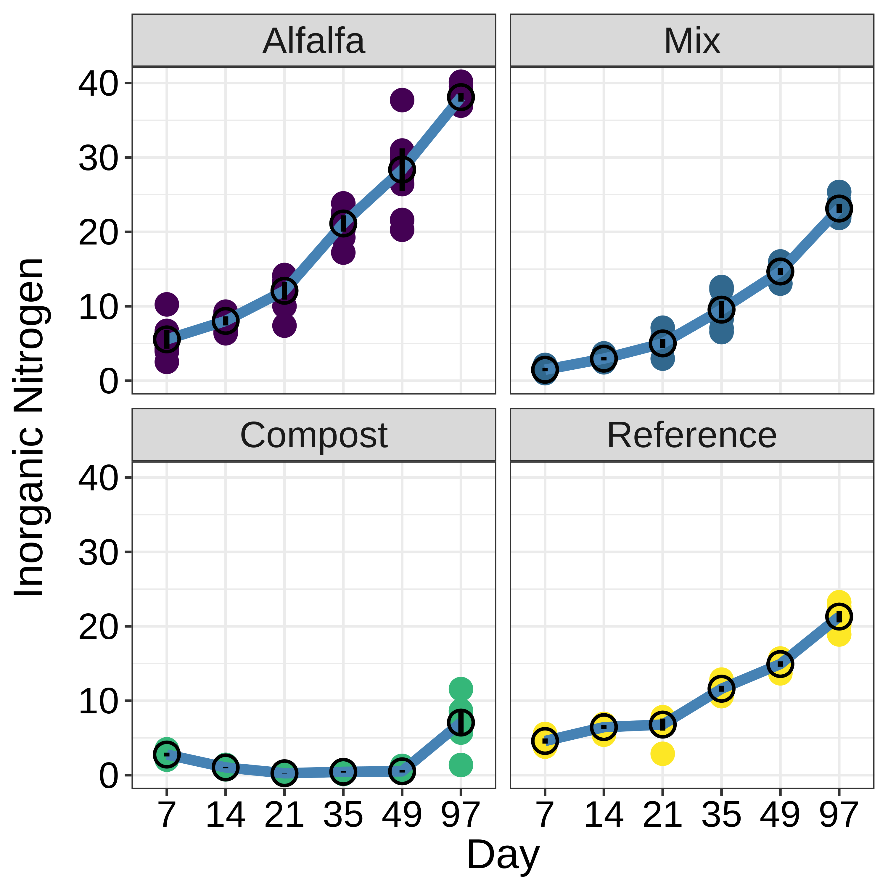
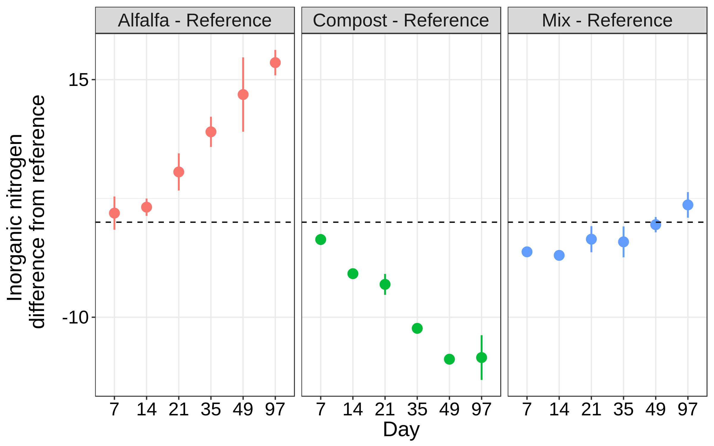
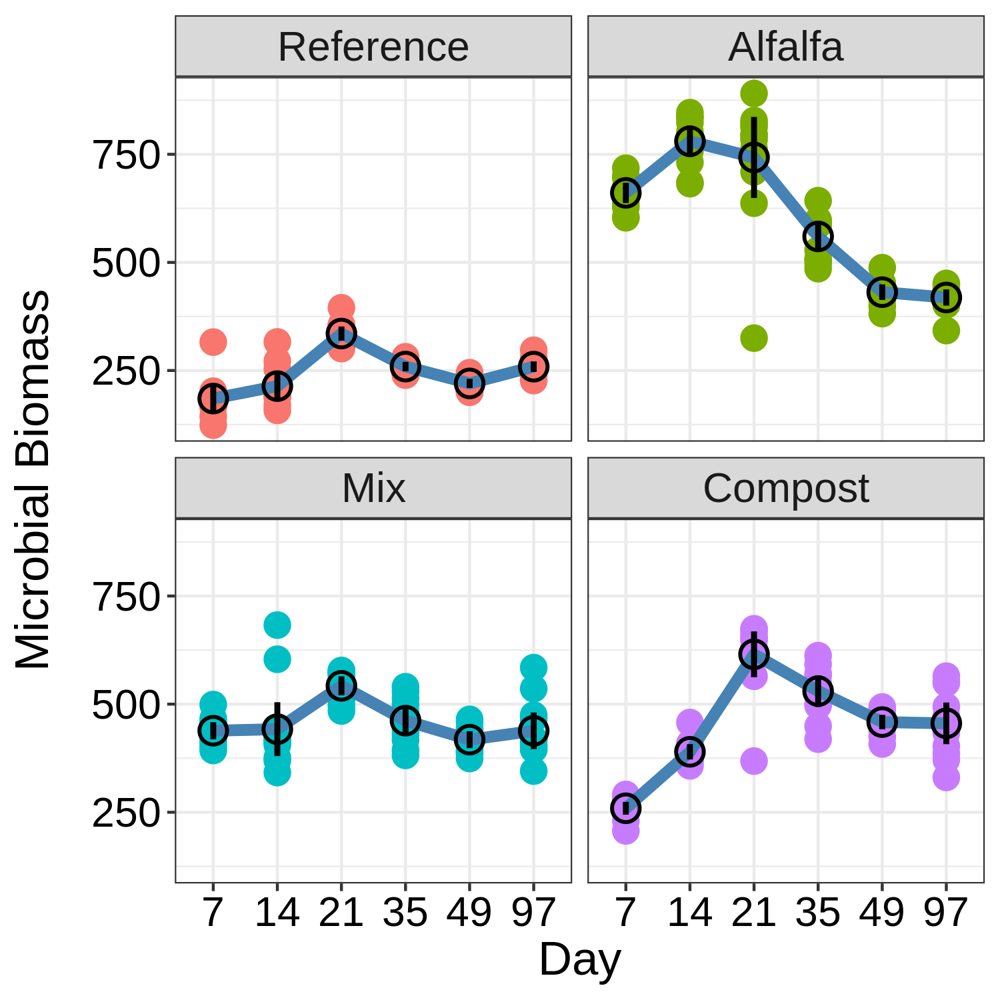
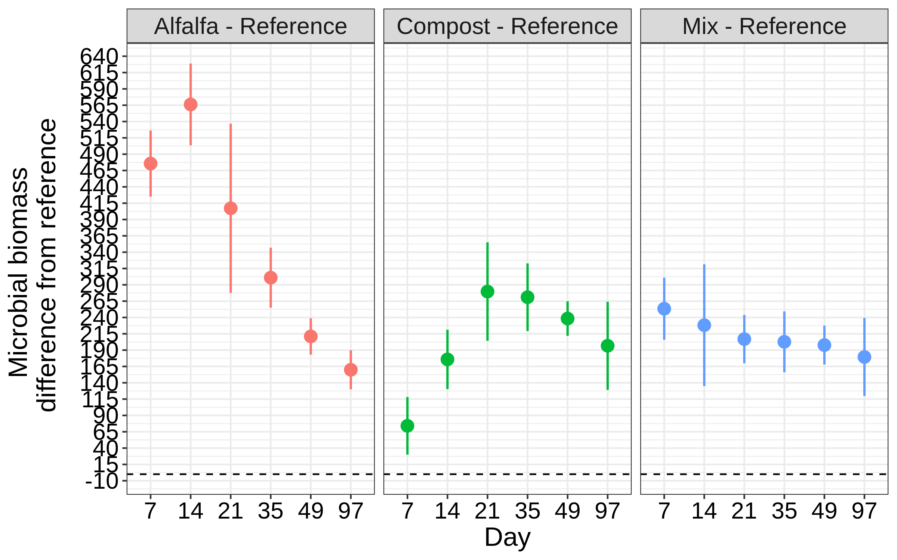

------------------------------------------------------------------------

> A thing is right when it tends to preserve the integrity, stability and beauty of the biotic community. It is wrong when it tends otherwise.
> ============================================================================================================================================

### How much does the soil microbiome/nutrients change from amendment?

PCoA of all amendments and baseline soils and time
--------------------------------------------------

First ordination using weighted unifrac and PCoA, there are no
amendments and reads have been rarified to 6k

Second ordinations using the raw object, note that day is not a factor
and that this has not been rarefied.

NMDS of all amendments, baseline soils and time
-----------------------------------------------

Same as above, but now I used NMDS instead of PCoA for the ordination  

Shannon Diversity of incubated microcosms.
------------------------------------------

There is an OTU in the compost day 14 samples that has super high
abundance, likely needs removed. 

-   Diversity is lowest in alfalfa day 7, this may suggest a more
    specialized bacterial community on day 7 than the other treatments
    or that the nutrient level is less selective than the more
    recalcitrant forms in the other treatments.

Relative Abundance of phyla in the inputs and the nutrient profiles of the inputs
---------------------------------------------------------------------------------

Nutrients contained in inputs:

<table>
<thead>
<tr class="header">
<th align="left">Input</th>
<th align="right">N_flash</th>
<th align="right">C_flash</th>
<th align="right">NH3</th>
<th align="right">NO3</th>
<th align="right">Inorganic_N</th>
<th align="right">C_N</th>
</tr>
</thead>
<tbody>
<tr class="odd">
<td align="left">Soil</td>
<td align="right">0.253000</td>
<td align="right">3.17800</td>
<td align="right">2.17300</td>
<td align="right">1.165333</td>
<td align="right">3.338333</td>
<td align="right">12.56126</td>
</tr>
<tr class="even">
<td align="left">Compost</td>
<td align="right">1.168000</td>
<td align="right">33.84267</td>
<td align="right">12.56000</td>
<td align="right">1.348000</td>
<td align="right">13.908000</td>
<td align="right">28.97489</td>
</tr>
<tr class="odd">
<td align="left">Alfalfa</td>
<td align="right">2.067333</td>
<td align="right">41.72433</td>
<td align="right">20.24589</td>
<td align="right">5.279778</td>
<td align="right">25.525667</td>
<td align="right">20.18268</td>
</tr>
</tbody>
</table>

Were the treatments significantly different? Adonis on the bray-curtis
distance

<table>
<thead>
<tr class="header">
<th align="left"></th>
<th align="right">Df</th>
<th align="right">SumsOfSqs</th>
<th align="right">MeanSqs</th>
<th align="right">F.Model</th>
<th align="right">R2</th>
<th align="right">Pr(&gt;F)</th>
</tr>
</thead>
<tbody>
<tr class="odd">
<td align="left">treatment</td>
<td align="right">2</td>
<td align="right">3.5261637</td>
<td align="right">1.7630819</td>
<td align="right">74.06469</td>
<td align="right">0.9367606</td>
<td align="right">0.001</td>
</tr>
<tr class="even">
<td align="left">Residuals</td>
<td align="right">10</td>
<td align="right">0.2380462</td>
<td align="right">0.0238046</td>
<td align="right">NA</td>
<td align="right">0.0632394</td>
<td align="right">NA</td>
</tr>
<tr class="odd">
<td align="left">Total</td>
<td align="right">12</td>
<td align="right">3.7642099</td>
<td align="right">NA</td>
<td align="right">NA</td>
<td align="right">1.0000000</td>
<td align="right">NA</td>
</tr>
</tbody>
</table>

Relative Abundance of phyla
---------------------------

 
# Chemical Response         
## Inorganic nitrogen            

I don't think ANOVA is the correct approach here for determing p-values,
this is a question that I need as a stats person.

Anova results on the linear mixed effect model defined by:
Inorganic\_N~treatment \* day, random=~1|replication

<table>
<thead>
<tr class="header">
<th align="left"></th>
<th align="right">numDF</th>
<th align="right">denDF</th>
<th align="right">F-value</th>
<th align="right">p-value</th>
</tr>
</thead>
<tbody>
<tr class="odd">
<td align="left">(Intercept)</td>
<td align="right">1</td>
<td align="right">253</td>
<td align="right">5557.0515</td>
<td align="right">&lt;.0001</td>
</tr>
<tr class="even">
<td align="left">treatment</td>
<td align="right">3</td>
<td align="right">253</td>
<td align="right">10708.1487</td>
<td align="right">&lt;.0001</td>
</tr>
<tr class="odd">
<td align="left">day</td>
<td align="right">5</td>
<td align="right">253</td>
<td align="right">2539.9503</td>
<td align="right">&lt;.0001</td>
</tr>
<tr class="even">
<td align="left">treatment:day</td>
<td align="right">15</td>
<td align="right">253</td>
<td align="right">488.1453</td>
<td align="right">&lt;.0001</td>
</tr>
</tbody>
</table>

Microbial Biomass
-----------------

Clustering analysis of communities over time   
Alfalfa

