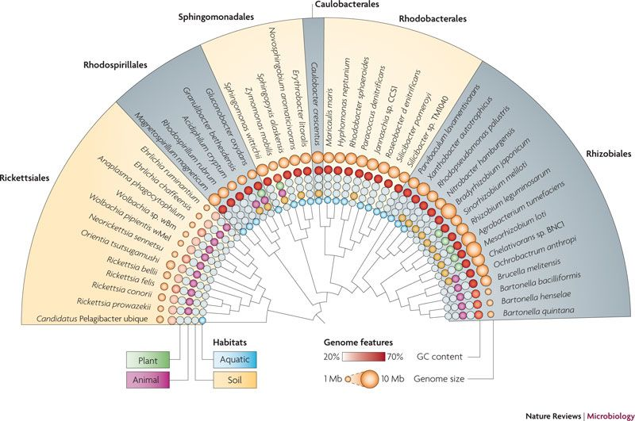
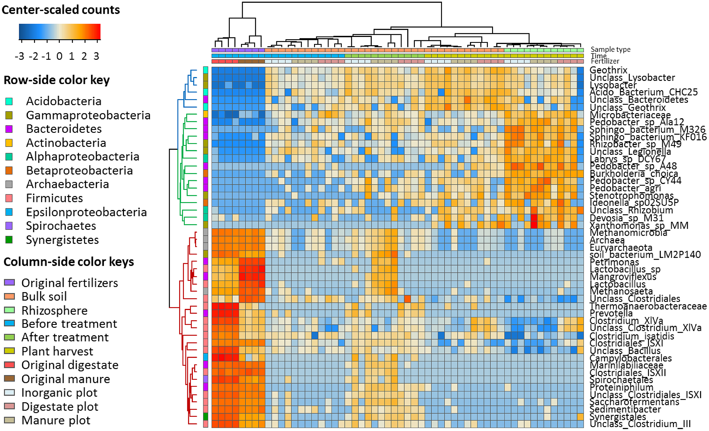

------------------------------------------------------------------------

> A thing is right when it tends to preserve the integrity, stability and beauty of the biotic community. It is wrong when it tends otherwise.
> ============================================================================================================================================

Longitudinal study of soils amended with four treatments of varying nutrient availability
=========================================================================================

------------------------------------------------------------------------

Questions:
==========

### HOW DO AMENDMENTS COMPARE? Are there differences in treatments? Similarities?

1.  Differences in community structure as measured by:
    1.  Microbial soil health measurements: Diversity, Richness  
        A. Dissimilarity measures (uni-frac + NMDS)  
        B. Most abundant species  
    2.  Nutrient soil health measurements  
        A. When and how are these differences most pronounced?  
        B. early and late time points  
    3.  who is always there - core analysis  
    4.  early and late responders  
        A. do these correlate to chemical data?  
        B. are there environmental conditions that describe the
        response?  
        + constrained CCA

        C. Where do these responders originate? Do they persist?

Jared's thoughts:
-----------------

-   What is the best way to leverage this data for future work not only
    on incubation, the STRIPs project for example?
    -   Take advantage of longitudinal aspect
    -   Representative sequences and FAPROTAX
    -   K and N strategists and how are they distributed across
        treatments and time?
    -   Nitrogen cycling bacteria distribution
    -   What functional categories can we get from FAPROTAX? EPS,
        N-Cycling, filament growth?

Objectives for short term:
==========================

1.  Use Jin's rep OTUs to construct a tree
2.  Use uni-frac for ordinations for the paper
3.  Cluster with uni-frac vs. bray-curtis, will capture more information
    regarding how the OTUs are related.
4.  Include networks in this paper? We could use FAPROTAX to add
    attributes to the network showing functional information?

###### From thesis:

> In this study, we study the impacts of amendments of both alfalfa and
> compost, provided at equal rates of total nitrogen, to a soil but with
> differing C: N ratios chosen to result in immobilization (compost) or
> mineralization (alfalfa). We characterize both the chemical and
> microbial response to these amendments and hypothesize that specific
> microbial communities will respond to initial nitrogen and carbon
> availability and that this membership will be specific to varying
> amendments. We expect that these distinct early microbial responders
> will dominate soil microbial communities in response to organic
> amendments and will decrease in abundance through time. Our objective
> was to characterize these early responding microbial communities for
> various organic amendments and to identify potential microbial
> membership within organic amendments that may be involved in plant
> nutrient availability.

Lit Review and desired figures
------------------------------

<https://www.nature.com/articles/nrmicro2367#f1>  
  
This figure could be of a response group, the habitat info replaced with
treatment, the GC content with ??? and the genome size with relative
abundance

<https://academic.oup.com/femsec/article/94/4/fiy027/4867966#116819013>

------------------------------------------------------------------------

> Bulk soil and maize rhizosphere resistance genes, mobile genetic
> elements and microbial communities are differently impacted by organic
> and inorganic fertilization

Identified responding OTUS, used edgeR

> Major phylogenetic changes detected at phylum/class levels and
> responding gen- era/OTUs were extracted by the likelihood ratio test
> after neg- ative binomial generalized linear modeling (nbGLM) of the
> raw counts with the false discovery rate (FDR) adjusted p-values
> (p-value &lt; 0.05, R package edgeR, Robinson, McCarthy and Smyth
> 2010)

What is the `likelihood ratio test`?  
<https://hbctraining.github.io/DGE_workshop/lessons/08_DGE_LRT.html>
